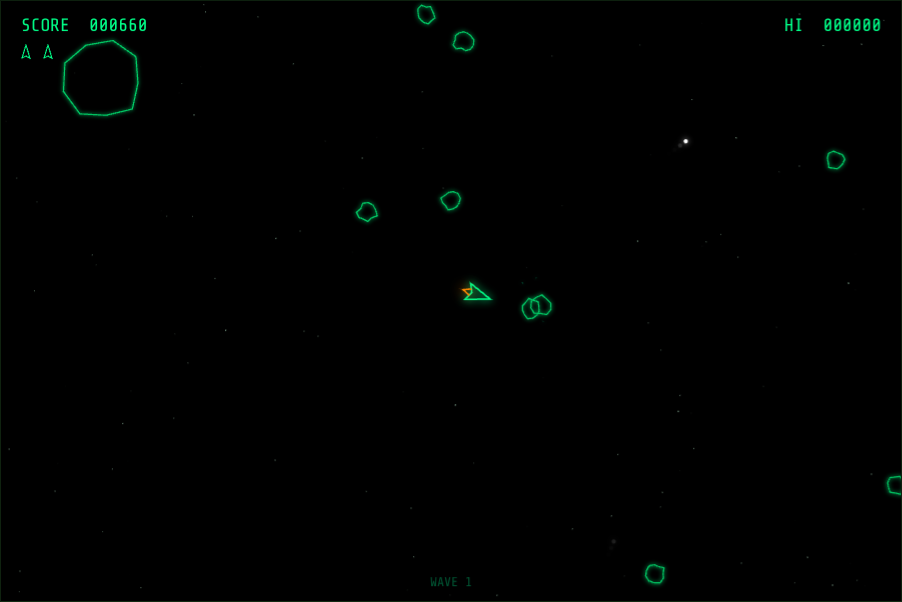
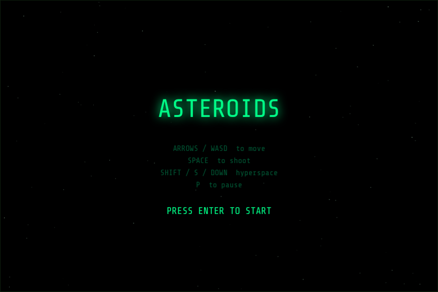

# Asteroids

A classic arcade Asteroids game built with HTML5 Canvas and TypeScript.

Phosphor-green CRT aesthetic with glow effects, particle explosions, and a twinkling star field.



## Play

**[Play it live →](https://asteroids-alpha-five.vercel.app/)**

Or open `index.html` in your browser.



## Controls

| Key                     | Action          |
| ----------------------- | --------------- |
| Arrow keys / WASD       | Move            |
| Space / F               | Shoot           |
| Shift / S / Down arrow  | Hyperspace      |
| P                       | Pause           |
| Enter                   | Start / Restart |

## Gameplay

- Destroy asteroids to score points. Smaller asteroids are worth more.
- Asteroids split into two smaller pieces when hit.
- You start with 3 lives and brief invincibility after each respawn.
- Hyperspace teleports you clear of trouble, but re-entry fails ~15% of the time and costs a life.
- Waves get progressively harder. High score is saved locally.

## Development

```bash
npm install
npm run build    # compile TypeScript
npm run dev      # watch mode
```
